1. Background

2. Vision and introduction

3. Security architecture of nodes

    3.1 Virtual machine

        3.1.1 Kernel hardening

        3.1.2 Hardening and security reporting in sub-operating system level

        3.1.3 Argus proof-of-security

        3.1.4 Blockchain-verified transactions, resource proofs and smart contracts

        3.1.5 Native anti-virus

    3.2 Cryptography plug-in service

    3.3 Fully decentralized identity and authentication

        3.3.1 Three-party operations

        3.3.2 Removing MITM attackers with a three party operation

        3.3.3 Example of registration & transfer of use rights

    3.4 Authorization security component

    3.5 A trusted signing service in a decentralized system

    3.6 Secure end-to-end communication

        3.6.1 Privacy and deniability protocol

        3.6.2 TLS with side channel session key authentication

        3.6.3. TLS without side channel session authentication

    3.7 Secure web server & web application firewall

    3.8 Attacks which can be prevented

4 Client-side security Wallet & client SDKs

5 Supernode infrastructure services and community projects

    5.1 Securing root of trust to the supernodes

    5.2 Performing consensus

    5.3 Administration and development of chains

    5.4 SLA management (mostly availability centered

    5.5 Secure distribution of updates

    5.6 Incident reporting and blacklisting shared across the whole community

    5.7 Supernode rewards and fees

    5.8 Backup and restoration services

    5.9 Recoverability from a hack or compromise

        5.9.1 Recoverability of stolen tokens via accountability and a grand consensus

    5.10 Whois-like or credit-rating server for a review of used APIs and security configurations

6 Community support and services

    6.1 Blockchain-backed community marketplaces

        6.1.1 Resource marketplace for security components and solutions

        6.1.2 Community marketplace for IT support, consulting and other services

    6.2 Native and systematic bounty program to drive community white-hacker engagement

    6.3 Developer insurance program

    6.4 Security-centered release process

7 Business adoption rationale

    7.1 Predictability of capital budgeting and business environment to support long term investments and customer adoption

    7.2 Savings on new or existing security solutions

    7.3 Ease of development

    7.4 Easy deployment with pre-hardened, flexible configuration

    7.5 Reinforced freemium model for security components in an open-source world

8 Governance

    8.1 Voting

    8.2 Frontier security research institute

    8.3 World security round table meeting

    8.4 Investment Program

    8.5 University partnerships

9 Token economy & ICO

    9.1 The perils of an inflation economy

    9.2 economy’s ability to generate amortization & contribution margin

    9.3 ICO investment as a function of economy performance & contribution margin

10 Ownership structure

    10.1 Legal governance

    10.2 Token Allocation

11 Roadmap

    11.1 Milestones so far

    11.2 1st stage - development priorities from now till beta launch

    11.3 2nd stage development priorities
    11.4 3rd and subsequent development priorities]

12 Abbreviations and definitions

13 Index of pictures

14 References

Show distributed nature of nodes and their
hierarchy:

Most important security aspects:

    Proof-of-transaction

    Proof-of-storage

    Proof-of-replication

    Data collection, traceability & reporting -  part of argus

Key management & crypto engine

Virtual hosting or IAAS providers

Payment network and exchanges

Earning coins:

Spending coins for actually valuable services:

Acceleration of security innovation

## One page executive summary
===================================

The internet has been built with little native security built into its
protocols. The security has been evolving gradually, but it followed a
path of patches for legacy solutions instead of fundamentally removing
the root-causes of insecurity and thus even in 2017 the cyber crime
costs the global economy $600bn. The complexity of security is a major
burden to companies of all sizes. The costs of commercial security
solutions is largely prohibitive for startups and SMEs. Young,
progressive security startups often struggle with getting their products
adopted because the managers in large companies often appear to buy
security from big-brand established companies for personal job-safety
rather than choosing the most secure solutions. Open source security
solutions (such as cryptography or OpenSSL) are offering some of the
best security protection when used on the infrastructure level, but they
failed to expand in scope mainly due to a lack of resources for
continuous development on both technical and business level. The
Infrastructureaddresses all these problems.

Foundation builds a technical infrastructure, security community and
innovative business models for all participants in the ecosystem. At the
core of the decentralized infrastructure is the Virtual Machine (VM) for
secure application runtime. It comes with some of the world’s most
advanced security hardening features exceeding the requirements set by
the US Military standards and it can prevent ~99% bugs in kernel and
application from becoming critical security vulnerability. Developers
can deploy the VM on any server and then run their applications inside
the VM. The VM also included specialized open-source security components
built as a service with simple APIs so that Developers can simplify and
accelerate their application development as well as improve the security
by using the provided APIs instead of trying to reinvent the security
solution or trying to reuse a security library they don’t fully
understand. The security components will be developed by both the
foundation as well as the community. Foundation will develop at least
the core features of data collection, automated remote updates and the
proof-of-security with Argus blockchain which together ensure the
integrity of the VM, all security components as well as the client
application and provide a lasting protection against tampering, APTs
among many others. Other security components will include a fully
accountable identity & authentication, secure end-to-end communication
or secure web server with web application firewalls among others.

Foundation creates a tokenized economy where all transactions are
recorded on permissioned chains, which are maintained by
community-approved network of supernodes. Consensus is a hybrid of PBFT
algorithm with our custom three-party authentication algorithm, which
systematically detects and excludes Man-in-the-middle (MITM) attacks
with every blockchain-backed transaction. Consensus transactions are
very efficient but the supernodes will charge approximately 5%
transaction fee, which will be used to systematically fund hacker bounty
programs, community rainy-day-fund insurance program and continued
development of the network, VM and security components. foundation
builds and develops 2 marketplaces:

1.  [Marketplace for security components where foundation, any
    contributor, young progressive startup or even established
    enterprises will be able to offer their products (initially security
    related, but later any kind of) and have them become a part of VMs
    with all the security benefits of proof-of-security and community
    bounty programs and more. The open-source components can be freemium
    and our proof-of-security enforces an honesty system where any
    unpaid use of premium open-source APIs will cause disincentives. The
    server resources and VMs will also be made available for a purchase
    there.

2.  [Marketplace for security services where developers will be able to
    hire contributors, experts or even specialized companies to perform
    IT support, consulting services or custom development.

All developers, applications, contributors, VMs or supernodes are a
part of community-backed reputation Whois service, which ensures data &
security transparency. If a malicious users launches an attack or uses
premium components without paying back, Whois service records that and
makes it publicly available for users’ decisions.

Foundation will launch a token and create all tokens at genesis
to prevent future value erosion. The token economy is initially
denominated in fiat for financial planning of long term investments, but
all transactions are made using tokens and the economy is systematically
built to incentive sellers & contributors to hold tokens. Foundation
will also use profits from premium security components for a
token-buy-back program to remove excess ICO tokens from circulation.

##1.Background
=====================

Global unrestrained market capitalism leads to monopolization and
monopolization leads to closed exploitive systems. The internet has
built great foundation for a distributed network where everyone can
come, be heard and make an impact, but even there the asymmetric returns
of a handful large companies such as Google, Amazon, Facebook or Cisco
has led to monopolization and a gross misuse of power, erecting barriers
to entry or stifling innovation.]{}[ The fundamentally open, distributed ledger technologies( DLT) such as
blockchain are reshaking many such monopolistic ares with historically
asymmetric returns such as finance, international trade multinational
commodity sourcing where farmer blockchain cooperatives are fighting the
exploitive multinational companies and powerful middlemen.

Cyber security is a complex area which has been failing to keep up with development of new services. Despite the fact that the global cyber security market is booming reaching $138bn in 20171, 84% of companies worldwide experienced a fraud and at least one cyber incident in 20172 and still $600 billion dollars are lost every year to cybercrime3 and hundreds of billions of dollars are lost to fraud alone. The situation will continue to get worse, because the whole security ecosystem is fundamentally unbalanced:

    * The large monopolistic players such as Gemalto, RSA or IBM prefer to sell new patches for extra revenue rather than solve the fundamental problems
    * Small and medium enterprises (SME) can’t afford IT security solutions and security personnel and much smaller number of large enterprises greatly outspend the countless SMEs in global cyber security expenditures
    * IT managers are often dominating over IT security, but IT managers understand little about IT security 
    * IT managers in large companies often lack detailed security expertise so they make purchases from the dominant security companies for their personal security instead of choosing the objectively most security solution from small companies
    * The level of difficulty of a single black hats hackers to break-in is much smaller than the difficulty of the defenders to stop every single hacker
    * There are immense payoffs to black hat hackers, while responsible white hat hackers often struggle finding a stable income from responsible hacking & reporting
    * The young generation of IT experts is ever less interest in white hat hacking, because the media labels all hackers as bad and never build reputation or credit to the white hat hackers
    * Open-source projects fail to generate sustainable revenues to continue development. These projects can’t afford paying the best experts which then have to find stable jobs developing closed-source solutions, which will never be available and affordable for small companies, bootstrap developers and enthusiasts
    * Remaining, mission-driven security experts are spread thin among thousands of open-source security communities and projects
    * Every new software project first focuses all attention on achieving the function and security comes as an afterthought. When it comes, small teams don’t have the expertise or money to implement security well 
    * Even blockchain resources are asymmetrically concentrated into trading and in supporting trading rather than extending the principles of decentralized security beyond the blockchain’s data integrity

RootOwl is addressing and solving all these problem through a combination of blockchain-enabled decentralization & data transparency, new open-source business models to drive sustainable development of open-source community security services, and incentive models for white hat hackers, progressive security startups, expert contributors, app developers, small companies, even large corporation and all other participants to build better, more secure internet services, apps and internet infrastructure.

## 2. Vision and introduction
The mission of the RootOwl is to provide a fully decentralized, democratic and secure blockchain-powered internet infrastructure, where developers can build secure applications, webapps, dapps or other software (referred to generically as application) faster, better and cheaper. In order to do that, RootOwl will provide a secure execution environment for the deployed application and provide a range of other network security services. To ensure continuous development and security of the infrastructure, RootOwl will serve as a platform for security experts, hackers and even progressive startups to achieve profitable, sustainable business models through building open source services and providing professional support to developers. 

RootOwl is an equivalent of the Internet infrastructure, but one which is built purposefully more secure in every way. RootOwl infrastructure is fully decentralized in nature and each participating server is natively running a RootOwl Virtual Machine (referred to as VM) with specially hardened kernel for increased protection from threats coming from the underlying operating system and the hardware itself. Each VM is equipped with several security components which provide discrete security functions (e.g. identity, authentication, web application firewalls, secure communication, signing and more) as a service via standard APIs. Developers can then deploy their applications, webapps, dapps or other software (referred to generically as application) into a sandbox within the the VM and connect the applications to the security component APIs. 

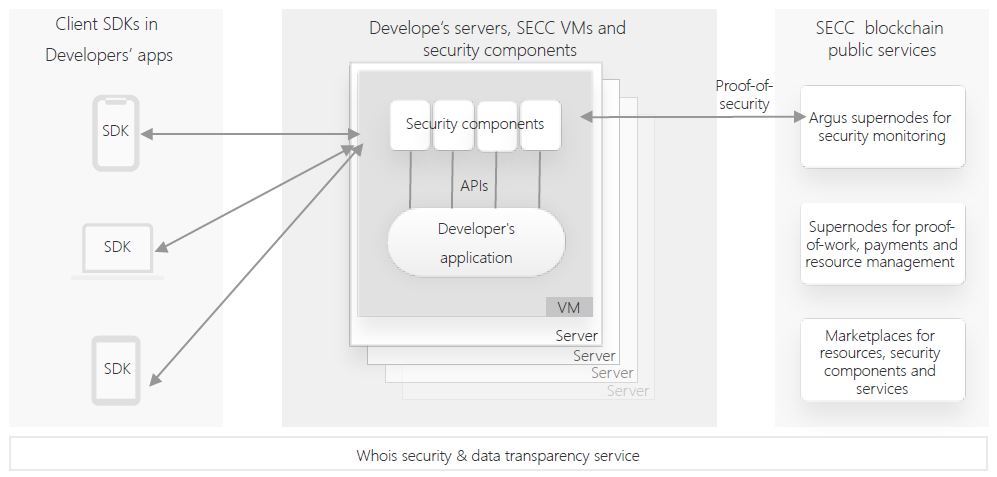

[    (Overall infrastructure architecture)]

All developers in the RootOwl network will be able to simplify and accelerate the development of the websites, webapps, applications and dapps by focusing on the business logic & UI while offloading all the tedious, complex security work on the security components. The RootOwl infrastructure will be similar to a hybrid of Android and Docker where a developer has easy infrastructure-layer tools for application deployment and doesn’t need to develop any security features because there are existing standard APIs. It will save time, costs, greatly improve the security and potentially even bring new business opportunities by proving a simpler, more secure and private service to the end-users. 

3 Security architecture of nodes
Nodes are the key building blocks of the RootOwl infrastructure and they host both the security components and the developers’ applications. Each node runs a lightweight VM with a hardened Debian Linux kernel based on the industry leading standards of PaX/Grsecurity. Using a VM provides the best combination of flexibility in hardware resource allocation, an easy deployment, scalability, updatability, unified hardware & firmware protection & interfacing as well as easy encapsulation of security components and APIs. 

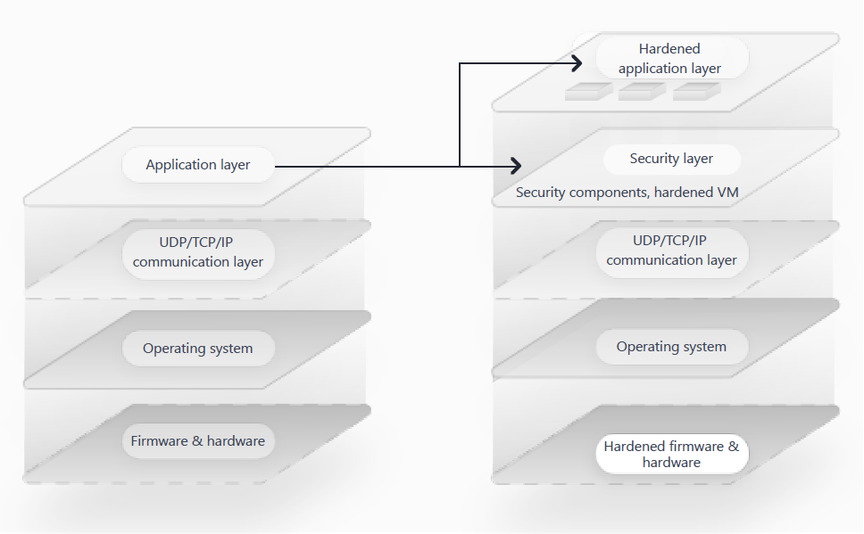

[    (Removing security from application layer)]

The nodes should in-time provide the deployed application with a holistic protection across all key security pillars of confidentiality, availability, integrity, privacy and non-repudiation or deniability through the a set of security components and their community- or company-developed alternatives to the standard security components.

The overall idea behind the security components is that there are large business and security advantage of removing custom security solutions from the application layer and use instead proven security solutions from the infrastructure layer. The perfect examples are using open-source security infrastructure solutions such as TLS for secure communication or SSH for remote access security instead of having each application developer to build her own custom TLS-like secure communication utility. RootOwl security components build on this concept and deliver an even greater value to the developers in terms of ease of development, lower costs of of development & maintenance, lower purchasing costs for security by providing infrastructure-level security services for more of the fundamental security needs. The security needs covered by security components include providing a runtime environment secured against operating system and hardware threats, using the proven crypto libraries, performing identity & authentication, authorization, ensuring a secure communication, keeping the security elements up-to-date, protecting against malicious web traffic requests, running forensing & reporting tools, verifying integrity of data against distributed public ledgers and other. 

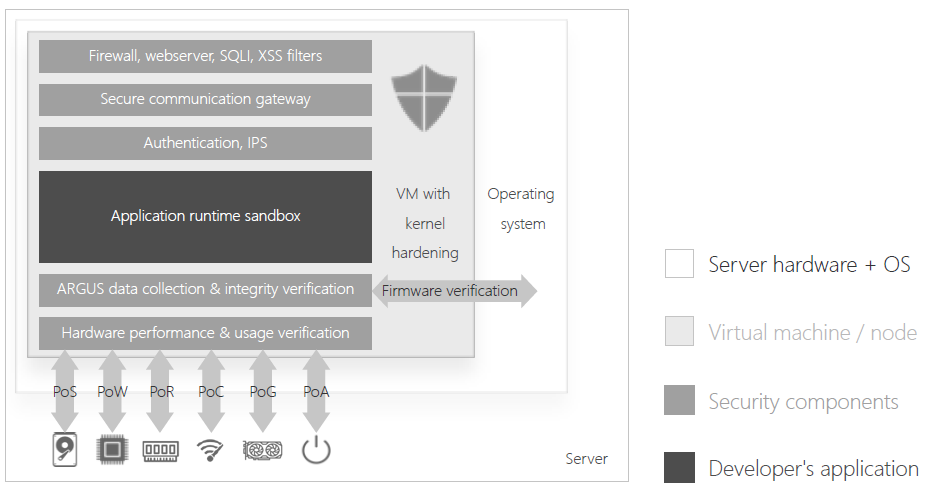

[    (Node architecture)]

The RootOwl infrastructure is open in nature and it actively encourages and supports a choice. The infrastructure includes tools to build, sell and use alternative versions of components or a premium addon functionality to existing components as well as provide a community-backed support, because some customers might have specialized needs. The infrastructure will also help protect the paid premium open-source components from being forked and used without permission.

## 3.1 Virtual machine 
The RootOwl virtual machine (VM) is the founding block of the RootOwl participation. An internet server joins the RootOwl infrastructure only after it has the VM installed, registered to the supernodes and registered to the owner. 

The reason for conditioning the participation in RootOwl by deploying a VM is because that is the best way to provide the best security for the developer’s application runtime as well as to achieve great scalability and administration capabilities. Relying on a virtual machine is much better than using containers or SDKs because a virtual machine has a full operating system, the kernel and compilers, which can be hardened. Containers offer some degree of sandbox separation, but they ultimately rely on an underlying untrustworthy operating system for the kernel, compilers and many other crucial utilities. SDKs are even less manageable and secure than containers. Finally, the use of virtual machines enables easy scaling in cloud services. The virtual machines also do not prevent a deployment of containers and their related infrastructure. There will be some changes required to use docker, rtk or the container orchestrations systems in the RootOwl infrastructure, but RootOwl foundation will be actively supporting the community to port the popular container systems.

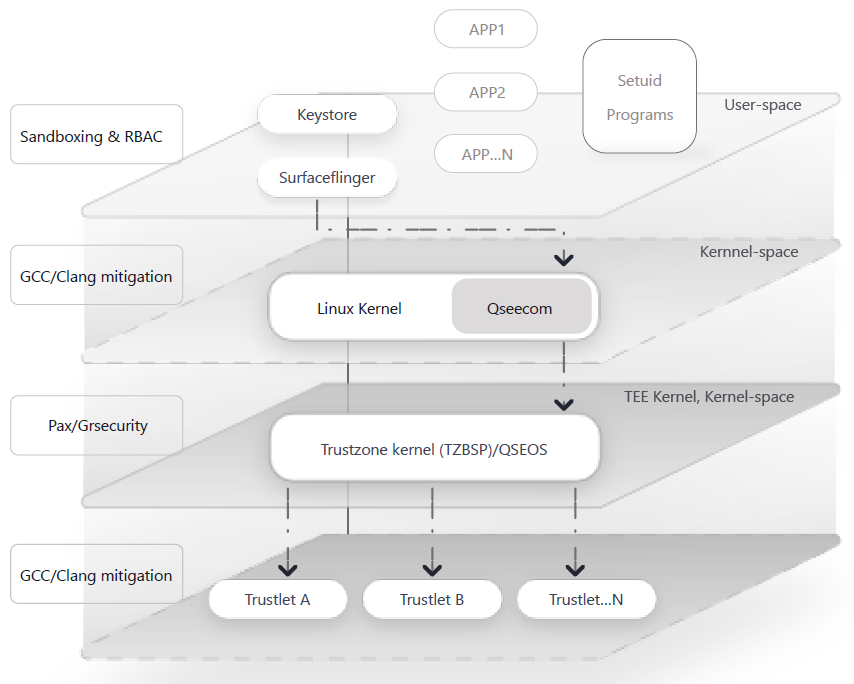

[    (Node hardening overview)]

The security must be considered all the way from hardware up. Some autonomous subsystems in chipsets, firmware, operating systems, system utilities and even installed untrustworthy applications running onto the operating system could all compromise the security deployed applications. Our VM together with certain security components utilizes some of the most advanced mechanisms to deliver a maximum level of protection, mitigation and detection of threats no matter from where they stem.

### 3.1.1 Kernel hardening
The kernel hardening of the VM provides an immensely important layer of protection against bugs in developers’ applications, bugs in the VM’s operating system, remote-code-executions and privilege escalations in the VM. At the core of the hardening are the best practices developed by PaX/Grsecurity lower attack surface by enhancing the memory address space protection, providing a role-based access control system, creating a much stronger sandbox protection, adding filesystem linking restrictions, improving the auditing capabilities and restricting chroot operations, among others. 

This work has an immense implication on security. An analysis by Ubuntu1 has shown that a proper kernel hardening is can stop up to 82% of zero-day exploits and vulnerabilities before they are known. More importantly, the hardened kernels can stop over 99% of the most serious exploits such as privilege escalations based on MITRE CVEs and Ubuntu Security Tracker2. Our hardening expert has worked on Linux kernel hardening using PaX/Grsecurity for years and he is responsible for a backport of a partially hardened kernel Linux kernel to Android. The solution was accepted and taken over by Google’s Android Open Source Project and integrated into Android Oreo. The hardened Android Oreo kernel largely mitigates some 45% of all kernel vulnerabilities3 and it helped identify and resolve massive exploitation in the wild for millions of embedded systems. 

However, this is only the tip of the iceberg. 

3.1.2 Hardening and security reporting in sub-operating system level
The initial version of the VM will run on servers with x86 architecture to tap into the largest available server resources. However, it also represents some security challenges. 

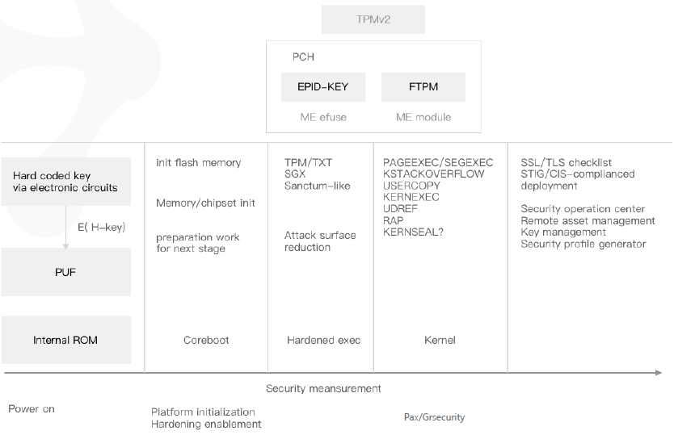

[    (Hardening measure throughout boot sequence)]

Firmware developed for x86 servers are often closed-source or largely unaudited. Each VM will include a unique Hardened Debian security audit (Harbian Audit), which has been developed by our team members to provide security transparency and verification for mission critical servers in the banking sector. The Harbian Audit in the VM will regularly perform a security audit for firmware and some key subsystems in the chipsets to provide security transparency for firmware and hardware as well as track changes. 

The VM will also help reduce the attack surface on the firmware and boot level by utilizing the server hardware’s  TPM (Trusted Platform module) with Intel’s TXT to run some of the most crucial cryptographic functions and and to store the hashes of UEFI/NVRAM, Grub2/shim, the kernel and kernel modules and run cmp at boot to verify the boot integrity. The VM will also utilize the server’s Intel Software Guard Extensions CPU instruction codes (on compatible servers), in order to store used crucial cryptographic material and other confidential information (e.g. communications session keys for an established end-to-end secure channel among others) into private memory regions in order to prevent access even by an attacker with elevated privilege levels or by an attacker with a direct access to the hardware server. 

Intel Management Engine (referred to as ME) on Ring -3 is a major security unknown with huge security risk implications. It’s a closed source about which Intel doesn’t want to talk or share information publicly. It allows a complete remote control of the server hardware and full access to storage drives, full LAN communication stacks and RAM even if the computer is powered down. To make things worse, the ME can access the hardware resources without being detected by operating level (Ring 0). The ME can’t be physically removed from the motherboards, because the motherboards would stop working. Our team has developed unique techniques to lower the attack surface and to scan the chipset for the use and configuration of the ME. The collected information will be reported as part of the proof-of-security (see below) and shared publicly in the blockchain for integrity and data transparency. Our team has also developed custom techniques and tools to perform remove certain code modules and leave only those modules we needed for the motherboard to work. The developed tools can also enable HAP to stop ME from running which is a mandatory configuration used at NSA. 

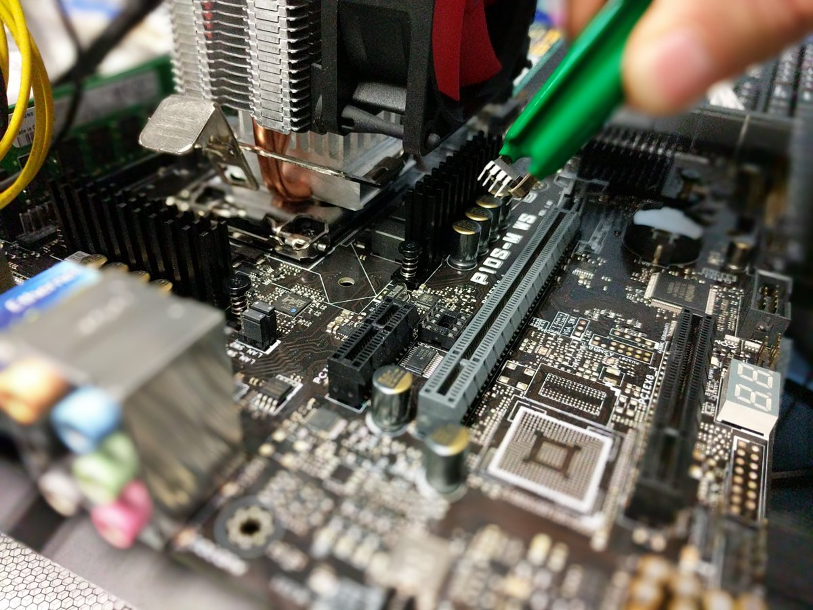]

[    (Actual photo of mitigating the ME with a custom chip_1)]

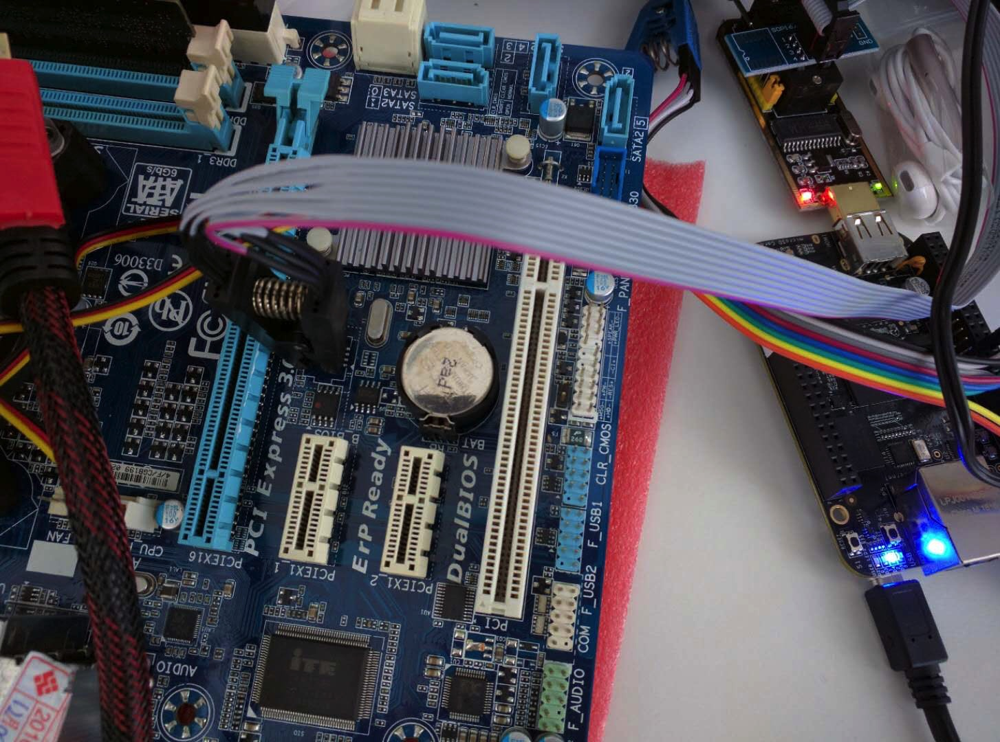]

[(Actual photo of mitigating the ME with a custom chip_2)]
[]{.c1}

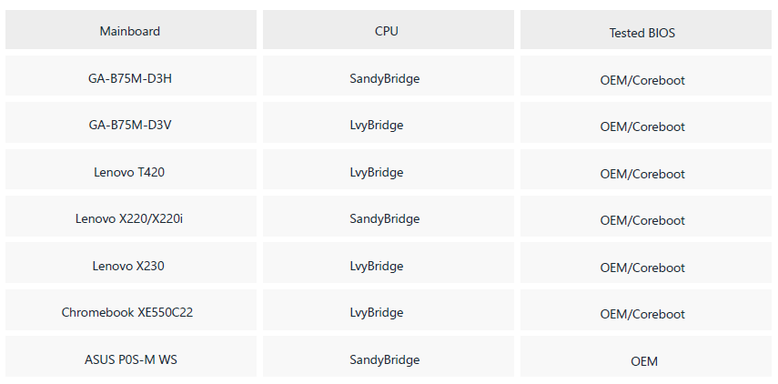]

Our team is currently researching a Ring -4 level security functions for RISC-V platform using MIT’s Sanctum, which aim to provide a unique level of protection and attack surface mitigation by leverage silicon-level internal ROM information and physical unclonable function (PUF) for hardware footprinting and secure storage of cryptographic seeds and keying materials. 

3.1.3 Proof-of-security
Proof-of-security is a fundamental and critical proof used to verify the security of the VM. At the core of the core of the proof of security are the audit and verifications of hardware, firmware, operating system security as well as VM code base integrity, configuration integrity, update status & check, incident report, anti-virus report and optional log collection. The proof of security is performed as an attestation between a VM and at least one supernode. This proof-of-security function isn’t a typical security components available via an API call. It is performed both regularly for security maintenance purposes as well as in an ad hoc fashion together with other important transactions, such as updates, backups, breach detection resolution or forensic investigation. 

[    (Proof-of-security
principle)] 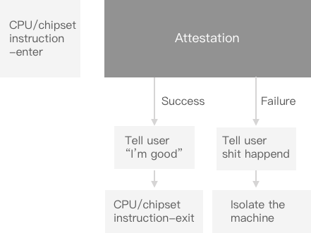]

The importance of this proof lies in the fact that computer resource proofs (see below), data reports and even crucial security updates rely on the integrity of the VM to perform as intended.

The first step in the proof-of-security is data collection specific for given hardware (Intel x86, AMD x86, RISC-V, ARM). The hardware, firmware and operating system integrity will be largely taken care of via an extended Harbian audit, which collects for the important configurations and statuses. There will be optional hypervisor attestations depending on the virtualization layer used. The VM code base integrity will be performed using a random challenge-response testing mechanism where the Argus supernode issues a random nonce-challenge and asks the proofing component to generate a Merkle-tree using the given nonce and the immutable data such as defined sections of the VM filesystem, system folders, configuration files and security components code base. The proofing components will also include antivirus reports, incident reports, system and components versions and logs will be attached for additional review and processing. 

The last check might include a review of the developer’s application code and tools located in previously non-audited folders. The purpose is to enforce an honesty system where the use of premium open-source libraries and code isn’t used without the payment or permission. A secondary purpose might be to identify a correct use of the APIs. A considered future version might include a premium service, which can assess code quality and identify potential known vulnerabilities in the code. 

After all data is collected and sent out by the local Argus service in the VM, Argus supernode will be responsible for performing a quick comparison of the data submitted by the proofing components against master data stored in the Argus chain. The conclusion of the chain can be information on successful completion, isolation of the machine or initiation of a security update. 

The results of the proof-of-security will aso be used by the Whois service (see below) in order to review and eventually update the security level of the VM, because certain customers from high-value industries, such as financial sector, require to understand whether a VM is and remains classified in critical, important or normal security level. The key to categorize the VM might differ from company by company, but it generally includes the used hardware hardening features and the scope of the attestations performed. An example is a verification that only a single VM is installed on the hardware and that it is the only entity with access to TPM. 

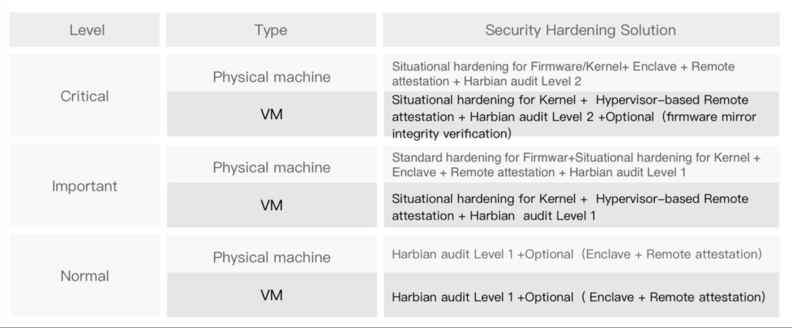
[    (Node categorization based on hardening level)]

### 3.1.4 Blockchain-verified transactions, resource proofs and smart contracts
Developers’ applications can easily tap into the blockchain infrastructure using a dedicated Proofing security component in the VM with a dedicated API for each individual proof. The initially available proofs should include:
    • Proof of Computation 
    • Proof of RAM
    • Proof of Storage
    • Proof of Graphics 
    • Proof of Connectivity 
    • Proof of Availability

The atomization of the proofs into the fundamental functions for different computational resources ensures a sufficient flexibility to build specialized services on top of the RootOwl infrastructure. Each of the proof will include at least 3 parties: at least who challenges, one who is tested and at least one Argus supernode.

The application drafts transactions or smart contracts, it then calls the relevant Proofing API and thus the data will be transmitted to the supernodes for integrity verification and consensus building. The supernodes will automatically add transactions to a block and inform user of the completion. 

### 3.1.5 Native anti-virus
Linux is mostly secure against viruses, but the application sandbox could be affected in rare situations
Antivirus will run real-time monitoring service and if an anomaly is detected it will be encrypted with the Argus supernode public key and either sent to Argus via an emergency protocol (e.g. VM code base tampering) or stored locally for future proof-of-security (e.g. virus detection and isolation).

## 3.2 Cryptography plug-in service
The first rule of cryptography is to never do your own cryptography. Different geographical regions, industries or even companies might have special requirements to use or not use certain cryptographic algorithms, which will require the RootOwl security components to be configurable towards the use of specific cryptographic algorithms. This helps achieve diverse compliance requirements without changing the security components or APIs and it serves a basis for the ability to evolve and dynamically strengthen the overall security of the security components over time, a good example might be a migration away from SHA-1 algorithm towards SHA-256 or other algorithm by changing a configuration in the VM without affecting the the security components or Dapp itself. 

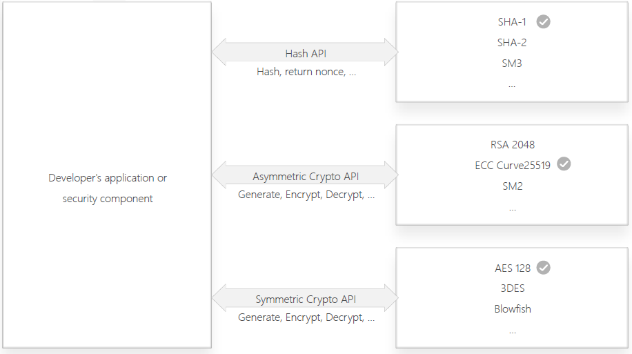
[(Cryptography as a configurable service for security components and applications)]

## 3.3 Fully decentralized identity and authentication
The most fundamental building block of any security architecture must be identity and authentication, because knowing a good guy from a bad guy makes almost all the difference. The centralized identities in the current cyberspace are fundamentally broken. Take example of the use of payments cards online. While no sane person would ever give the payment card and its PIN to a stranger, this is exactly what we do online. Whenever a user sends the information from the card (such as the card number, expiration date, CVC code), the user de facto creates a fully authentic clone of the card and hands it to an untrustworthy actor, her computer, who in turn creates copies by handing over the card information (the de facto authentic card itself) to the internet and semi-trusted online service. The situation is even more dire with ID cards which are used for authentication (instead of identification only). The same dysfunctional identity through symmetric secrecy is also the case in the omnipresent passwords and partially OTPs. The use of PKI is broken in myriad other ways, mainly through the complexity and expensive use, but also through the centralized Certificate Authorities, which have been repeatedly subverted by governments or outright hacked resulting in systematic insecurity.

The use of public private keys in blockchain services is a large step forward, but the asymmetric keys still fail because the keys are often copied, reused, left unprotected from copying or misuse and are used in a way which is vulnerable to future quantum computers without having native mechanisms to recover or migrate to another scheme. If the identity and authentication using the private key followed the decentralized, trustless principles which made blockchain so powerful, we would not have seen so many news of stolen bitcoins, ethers and many other tokens. 

The key characteristics of a truly secure digital identity and authentication are: fully distributed, without reuse, not reliant on user to perform it well, based on mutual trust, able to be secure even in an unsecured environment or communication channel, protected against copying, dynamic over time and protected from a remote execution. These sound like a lot, but a good security architecture as a service can be achieved and used with an absolute ease.

The most fundamental building block is a mutual use of 2 asymmetric key pairs (no PKI and no Certificate Authority). See diagram below:

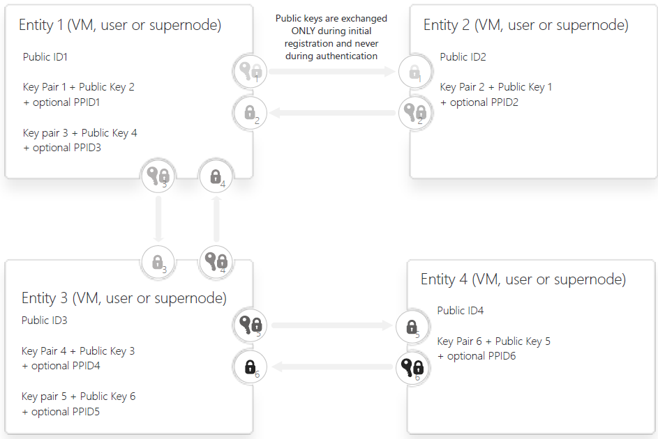
The identity & key pair registration, usage, renewal and incident management and other transactions are all managed automatically by the Identity security component in the VM (and client SDKs in case transactions involving a user) without active involvement by any human.

Since Public ID1 and Public ID2 are known to other parties (mainly through blockchain public records), the Entity 1 or 2 can choose (through a configuration option) to also create and exchange unique Point-to-point IDs (PPID1 and PPID2) to ensure a private subsequent identification without the use of Public ID1 and Public ID2. Choosing to create and use the optional Point-to-point ID for each binary relation also makes it much harder to track user’s identity across the network and thus maximizing the privacy through decentralization, which is otherwise a weakness in traditional blockchain systems with a single ID. 

The use of two mutual point-to-point key pairs and treating the exchanged public keys as a secret is important to avoid any phishing and certain man-in-the-middle (referred to as MITM) attacks. It also serves a basis to achieve quantum-computer resistant public-private-key encryption and authentication as long as 
    1. the public keys have not been been intercepted by a party with access to a quantum computer
    2. All future key exchanges, public signatures and records do not disclose the public key
    3. The renewal of the public key happens within a channel which has previously been quantum resistant (condition 1 & 2 are met)
    4. The Identity & Authentication component has not been compromised & stolen by an attacker with access to a quantum computer (however, such a compromise should be limited only to the decentralized server because point-to-point key pairs are never reused)

The fully automated, humanless management of the ID & authentication encapsulated in the security component enables additional layers of algorithmic and cryptographic protections of the IDs and secret key pairs without affecting the ease of use or scalability. The security service will be sandboxed in a hardened VM, there will be mutual usage counters for each key and HW footprinting as 2nd & 3rd device-authentication-factors, transaction signing (see below) and eventually 2nd and additional user-authentication-factors. The use of these additional layers will be mostly native, but some (such as additional factors and transactions) will be activated using a dedicated API call. 

Each Entity has unique asymmetric key pair for each point-to-point relation with another Entity. For example, if a Dapp developer runs her Dapp in a cluster of 100 VMs, the Dapp developer (and the VMs) will need to have at least 100 unique key pairs to access all her VMs. This might sound like a huge burden to the system and user, but all keys are automatically used by the SDK for user and via the automated security component via a simple API. Storage isn’t an issue, because each identity and key pair take up just bytes or kilobytes. This is a small price to pay for achieving significant security benefits:
    • no single-point-of-failure which can cause denial of service and 
    • eliminating a reuse of cryptographic material and thus improving traceability & forensic abilities 
    • eliminating risks associated with a theft of a centralized ID database as it is the case with passwords databases, where an attack breaks into, let’s say, ebay.com and can causes a compromise of security at amazon.com

Finally, this architecture of decentralized identities with systematically prevented reuse of identities achieves a true accountability in the cyberspace. One could say that digital certificates represent an accountable ID online, but the archaic, centralized user-dependent PKI security architecture is broken on so many levels. We can just look at the security issues such as multiple stolen of private keys from certificate authorities, security problems with certificate chaining, many hopeless developers who uploaded digital certificates to github, use of custom unrecognized CAs, state-level exploitation of CAs in China or Iran for eavesdropping, the sheer difficulty to configure a PKI infrastructure correctly and the huge cost. PKI has been (dying) on the internet for over 30 years and a complete lack of large scale deployment for universal use for users and services only underlines that this system is broken and will never achieve more than paper-dragon-accountability.

Additional advantage of automation via a service interface is the fact that additional security component can be built on top of the Identity and Authentication security component by tapping into the available API calls, variable and return values, which enable the same identity service to be easily extended into other security components (such as end-to-end communication, digitally signatures, verifying integrity of security updates and more) which can instantly achieve a fully distributed, secure qualities.

### 3.3.1 Three-party operations
The use distributed point-to-point identity and authentication also enables formation of a consensus building web of trust and compatibility with Practical Byzantine Fault Tolerant algorithms. The most fundamental building element of such a web of trust is a relations between three parties as outlined on the diagram below:

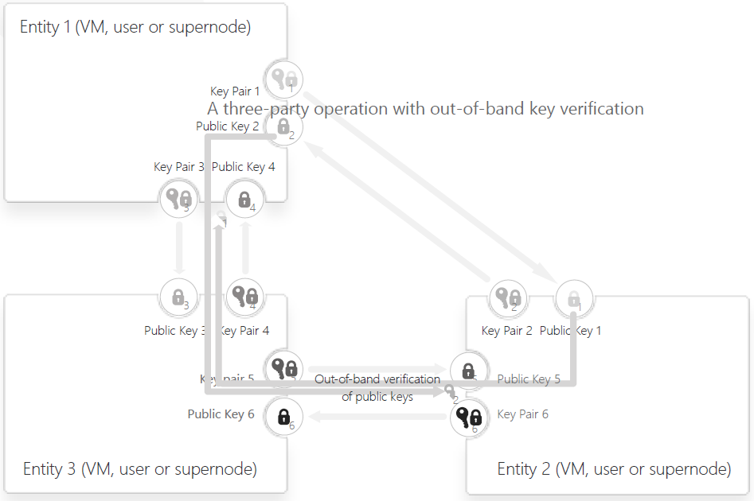
[(An example of a three-party operation verifying key pair integrity among Entity 2 and Entity 3)]

These three entities on the diagram above can now perform some powerful operations:
    1. Intermediating trust at registration: Two entities can establish a proven trust through several way, such as via an in-person, offline exchange of public keys, via a trusted identity verifiers (e.g. company system admin), via secure channel (such as through an ATM) or even quantum-resistant channel. If the Entity 1 has established such a trustworthy connection with Entity 2 and Entity 3, the Entity 1 can serve as a trust agent intermediating the establishment of trustworthy point-to-point key pairs 5 & 6 between Entity 2 and 3 without creating a single point of failure. This is done by leveraging the trustworthy channel between Entity 1 and Entity 2 and separately between Entity 1 and Entity 3 and passing a cryptographic checksum to the point-to-point key pairs 5 & 6 partially through the Entity 1 and partially directly through the direct point-to-point channel between the Entity 2 & 3. In this scenario, the exchange of the public keys of the key pairs 5 & 6 will never be fully accessible to either the Entity 1 or any attacker between Entity 2 & 3. This guarantees both privacy and trust worthy identity through the extension from Entity 1.
    2. Establishment of a shared secret for communication in a group of entities: run at least a three-party operations for each participant, share a part of the secret or the whole secret in such a way that the whole group can verified that all authentication concluded correctly (no MITM identified) and that the proper shared secret was established among all
    3. Network-wide alerts and incidents management: If there is an identified and proven security breach, trigger three-party operations to create a trustworthy warning, blacklisting and/or trust revocation of affected nodes and keys to prevent additional damage by the affected node.
    4. Performing thee-party consensus: Entities (e.g.) 2 and 3 can use Entity 1 as an independent arbiter for a mutual agreement between Entity 2 and 3 (see A trusted signing service in a decentralized system for more details). 
    5. Removing MITM attackers (see following section)

### 3.3.2 Removing MITM attackers with a three party operation

The power of three-party operations doesn’t stop there. All the three-party operations can be scaled up to include multiple three-party operations together and each additional three-party operation strengthens the conclusion of the previous three-party operations. An example of a potential use of the three-party operations is the strengthening the security at the initially user registration to the RootOwl supernodes, because this is the potentially weakest element in the life-cycle of all identities where a MITM attack could in theory results in theft of all identity and fraud. The described mutually authenticated scheme above is also vulnerable to it though only if the MITM is present at the first key exchange and every single one future point-to-point authentication. However, the three-party operations represent a solution to systematically prevent current and future MITM attacks. 

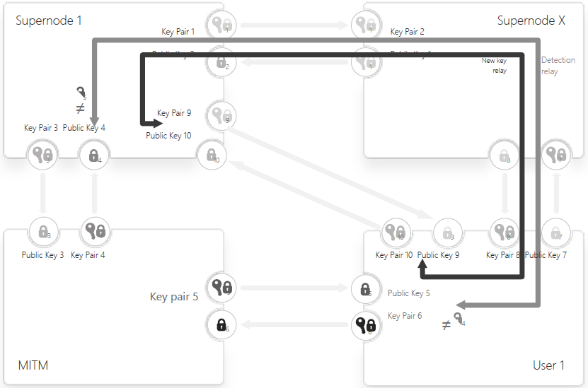
We can assume these scenarios:
    1. A User 1 intends to register with a Supernode 1, but a MITM inserts itself with 2 key pairs (one to Key pairs 5 to User 1 and Key pairs 4to Supernode 1). User 1 believes that public key 5 belongs to Supernode 1 and Supernode 1 believes that public key 4 belongs to User 1
    2. User 1 can reach out to Supernode X and initiate a three party operation with intended Supernode 1
    3. User 1 shares a hash of public key 5 assummigly sent by Supernode 1 via the point-to-point mutually verified channel (channel 7-8) to Supernode X, which in turn forwards the public key hash via the trusted channel 1-2 to Supernode 1
    4. Supernode 1 shares a hash of public key 4 assummigly sent by User 1 via the trusted channel 1-2 to Supernode X, which in turn forwards the public key hash via the point-to-point mutually verified channel (channel 7-8) to User 1 
    5. If User 1 and Supernode 1 receives the hashes and they will be able to conclude the existence of the MITM, because User 1 receives a hash of public key 4, which does not match the hash of the her own public key 6 intended for the Supernode 1. Supernode receives a hash of public key 5, which does not match the hash of the its own public key 3 intended for the User 1.
    6. User 1 and Supernode 1 can create new key-pairs (9 and 10) also use the reverse channels (1-2 and 7-8) via Supernode X to exchange the public keys 9 and 10
    7. User 1 and Supernode 1 can afterwards create a new authentication and secure communication directly using the Key pairs 9 and 10 and completely exclude the MITM

The direction of the three-party operation can also be changed so that the Supernode X and User 1 can detect and eliminate the MITM on their connection or so that the Supernode 1 and Supernode X can detect and eliminate the MITM on their connection. 

Interestingly, even if there are 2 uncoordinated MITM attackers on any two different connections, the MITM attackers will be both eliminated through 2 three-party operations done in sequence. This also means that a prevalent use of three-party operations has the potential to exclude every single MITM attacker from the network.

A case of increasing the trustworthiness of consensus via running multiple three-party operations is described below in the section A trusted signing service in a decentralized system.

### 3.3.3 Example of registration & transfer of use rights
The same three-party operation and exclusion of any MITM described above can be performed when a User 1 registers her VM 1 or makes a trade with User 2. User 2 and VM 1 serve the role of the Supernode X in the scenario above. Here is an outline of a typical scenario :

    1. User 1 registers to the RootOwl network:
        a. User 1 creates a unique ID User 1 
        b. Supernode 1 creates Key pair 1 and sends Public Key 1 to User 1
        c. User 1 creates Key pair 2 and sends Public Key 2 to Supernode 1
        
    2. User 1 installs a VM 1 on a her node and registers herself as an administrator:
        a. VM 1 creates a unique ID VM 1
        b. User 1 creates Key pair 3 and sends Public Key 3 to VM 1
        c. VM 1 creates Key pair 4 and sends Public Key 4 to User 1
        
    3. The VM 1 automatically registers itself to the RootOwl network:
        a. Supernode 1 creates Key pair 5 and sends Public Key 5 to VM 1
        b. VM 1 creates Key pair 6 and sends Public Key 6 to Supernode 1
        
    4. User 1 establishes the initial ownership of the VM 1 in the RootOwl network (a three-party operation):
        a. User 1 performs the three party operation between VM 1 and Supernode 1 as a relay and User 1 mutually delivers the hash of Public Key 5 and 6 to the Supernode 1 and VM 1 respectively
        b. If the three-party operation is successful (or once any MITM attacker is excluded), Supernode 1 initiates a consensus to establish User 1 as an owner of the VM 1 
        
    5. User 2 registers to the RootOwl network:
        a. User 2 creates a unique ID User 2 
        b. Supernode 1 creates Key pair 7 and sends Public Key 7 to User 2
        c. User 2 creates Key pair 8 and sends Public Key 8 to Supernode 1

    6. User 2 agrees to buy the rights to use the VM 1 from User 1 under conditions from a smart contract (a three party operation):
        a. User 1 creates Key pair 9 and sends Public Key 9 to User 2
        b. User 2 creates Key pair 10 and sends Public Key 10 to User 1
        c. User 1 and User 2 contact Supernode 1 to serve as an arbiter for the signing. Theyconfirm the selection of the Supernode by completing a three-party operation where hashes of point-to-point public keys are mutually relayed
        d. User 1 and User 2 both sign the smart contract and Supernode 1 validates the contract and initiates consensus (see section A trusted signing service in a decentralized system for more details)

    7. User 2 registers to VM 1:
        a. User 2 creates Key pair 11 and sends Public Key 11 to VM 1
        b. VM 1 creates Key pair 12 and sends Public Key 12 to User 2

    8. Once the mutually signed and agreed consensus is created, the Supernode 1 transfers the administrator rights from User 1 to User 2 (a three-party operation):
        a. Supernode 1 requests the User 1 to establish it as the administrator of VM 1 
        b. Once done, the Supernode 1 enters into the VM 1 and loads a configuration file from the signed smart contract
        c. Supernode 1, VM 1 and User 2 perform a three party operation where hashes of point-to-point public keys are mutually relayed in order to exclude any and all MITM between all three parties.
        d. Supernode 1 transfers administrator rights to User 2 and initiates the first proof-of-security which will be registered the master record to Argus chain. 
        e. Once the proof-of-security is concluded and registered in Argus chain, the VM 1 becomes accessible to User 2

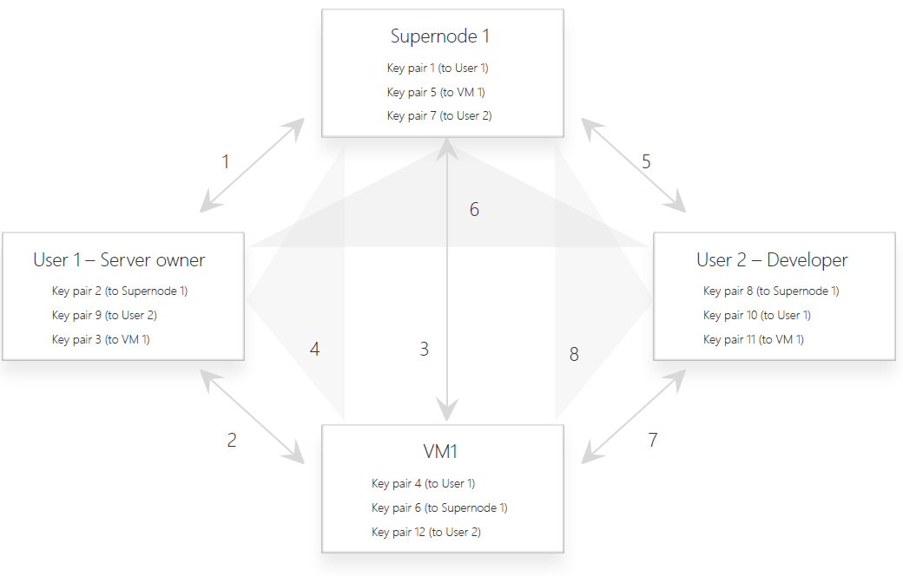

[(Example of a process associated with VM purchase in network)]

## 3.4 Authorization security component
The initial authorization service will include basic roles determining the access access rights to various resources of the VM and the most fundamental purpose will be to facilitate authorizing administrators and performing transfers of use-rights as described in the previous section. A later stage iteration or a whole different authorization components provided by community members should provide a more granular role-based system so that Developer’s applications can manage user roles and access rights via a security components as a service instead of building an authorization functionality into the application itself.

## 3.5 A trusted signing service in a decentralized system
Once the initial registration authentication between two point to point parties is completed (directly or via one or multiple trusted 3rd parties) and the two newly registered parties mutually hold a secret private key unique for the counter-party and the counter-party’s public key unique for itself. The exchanged, never shared public keys unique for this point-to-point relationship can be used for point-to-point digital signatures which don’t require a certificate authority as long as the registration of the public keys is trustworthy or performed via a three-party operation. 

A public digital signature between User 1 and User 2 can still be achieved in a decentralized system using a three-party consensus between User 1, User 2 and any Supernode (Supernode 1 in the example below) which has an established mutual trust to Users 1 and 2 (Supernode’s role is similar to that of a notary). 

The three-party consensus process is as follows:

    1. User 1 and User 2 agree on terms of the smart contract
    
    2. User 1 and User 2 select one or multiple Supernodes (Supernode 1 in this example) and perform a three-party operation between them to eliminate any MITM attackers

    3. User 1 digitally signs its version of the agreed contract/message using User 1’s private key 2 unique to the mutual relationship between User 1 and Supernode 1

    4. Supernode 1 independently verifies the signature integrity and the content of the contract/message sent by User 1 using User 1’s public key 2

    5. User 2 digitally signs its version of the agreed contract/message using User 2’s private key 4 unique to the mutual relationship between User 2 and Supernode 1

    6. Supernode 1 independently verifies the signature integrity and the content of the contract/message sent by User 2 using User 2’s public key 4

    7. If the two contracts/messages are both verified and the content is identical, the Supernode 1 will 
        a. Encrypt the received contract/message and the signature sent by User 1 using User 1’s public key 2
        b. Encrypt the received contract/message and the signature sent by User 2 using User 2’s public key 4
        c. Sign the contract/message and encrypted text 5a and 5b using Supernodes Private key used for other Supernodes and share it for consensus

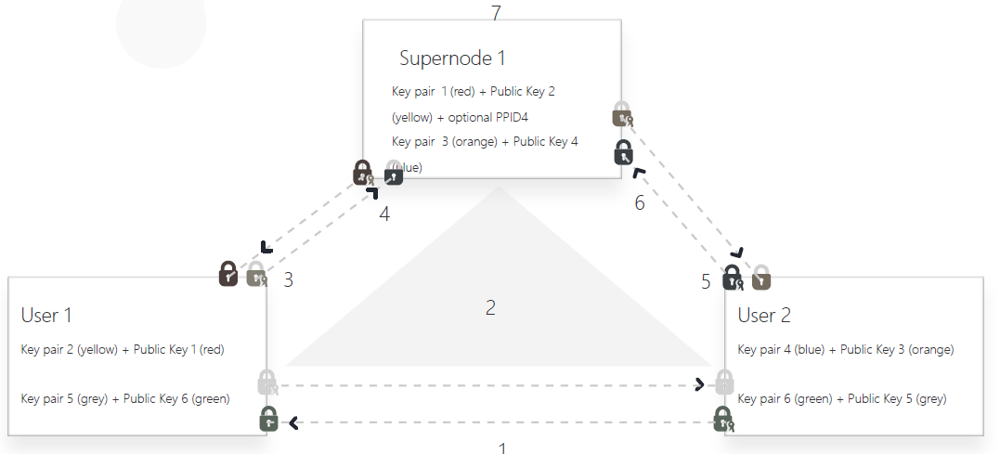]
[(The process of trusted signing in a decentralized system)]

If such a three-party notary transaction will be verified by only a single Supernode (e.g. a nano-transaction), a small fee will be paid only to the Supernode for its notary service. However, this notary service is very computationally and cost efficient so the actual fee will be small enough. This should encourage the User 1 and/or 2 to pay a premium for a more secure consensus and get the verification performed through multiple three-party consensuses with multiple Supernodes (User 1 - User 2 - Supernode 2, User 1 - User 2 - Supernode 3, …. User 1 - User 2 - Supernode N). The contract will be in a form of a smart contract, which would enter into effect only if all the three-party consensuses are completed successfully (once a sufficient number of supernodes’ signatures is collected).

## 3.6 Secure end-to-end communication
Secure communication is a major topic with an intersection of many protocols and diverse business needs. Our initial research of this area leads to thee different solutions which each has different requirements and limitations:
distinct, decentralized end-to-end communication solution and one compatibility-driven solution. One centered around privacy and deniability. Once centered around traceability and accountability.

### 3.6.1 Privacy and deniability protocol
There are several protocols, which we considered for the initial integration into the RootOwl. We engaged the community for feedback and come to favor the OTRv3 (off-the-record) protocol over Signal protocol, because it does not preserve anonymity, requires centralized servers for the relaying of messages and it requires storing of public key material on centralized servers.

We however see a potential to improve the anonymity and security of the OTRv3 protocol by connecting it with the RootOwl Identity and Authentication. Our implementation of the OTRv3 achieves:

    • No any publicly used identifiers of the client are shared 
    
    • Public keys are never sent or exchanged and thus quantum-computer resistance is maintained
    
    • Protocol implementation is simplified thanks to reuse of the Identity & Authentication security component

Bob will be initiating the AKE with Alice.

    • Bob:
        1. Picks a random value r (128 bits)
        2. Picks a random value x (at least 320 bits)
        3. Sends Alice AESr(gx), HASH(gx)
        
    • Alice:
        1. Picks a random value y (at least 320 bits)
        2. Sends Bob gy
        
    • Bob:
        1. Verifies that Alice's gy is a legal value (2 <= gy <= modulus-2)
        2. Computes s = (gy)x
        3. Computes two AES keys c, c' and four MAC keys m1, m1', m2, m2' by hashing s in various ways
        4. Picks keyidB, a serial number for his D-H key gx
        5. Computes MB = MACm1(gx, gy, pubB, keyidB)
        6. Computes XB = pubB, keyidB, sigB(MB)
        7. Sends Alice r, AESc(XB), MACm2(AESc(XB))
        
    • Alice:
        1. Uses r to decrypt the value of gx sent earlier
        2. Verifies that HASH(gx) matches the value sent earlier
        3. Verifies that Bob's gx is a legal value (2 <= gx <= modulus-2)
        4. Computes s = (gx)y (note that this will be the same as the value of s Bob calculated)
        5. Computes two AES keys c, c' and four MAC keys m1, m1', m2, m2' by hashing s in various ways (the same as Bob)
        6. Uses m2 to verify MACm2(AESc(XB))
        7. Uses c to decrypt AESc(XB) to obtain XB = pubB, keyidB, sigB(MB)
        8. Computes MB = MACm1(gx, gy, pubB, keyidB)
        9. Uses pubB to verify sigB(MB)
        10. Picks keyidA, a serial number for her D-H key gy
        11. Computes MA = MACm1'(gy, gx, pubA, keyidA)
        12. Computes XA = pubA, keyidA, sigA(MA)
        13. Sends Bob AESc'(XA), MACm2'(AESc'(XA))
        
    • Bob:
        1. Uses m2' to verify MACm2'(AESc'(XA))
        2. Uses c' to decrypt AESc'(XA) to obtain XA = pubA, keyidA, sigA(MA)
        3. Computes MA = MACm1'(gy, gx, pubA, keyidA)
        4. Uses pubA to verify sigA(MA)
        
    • If all of the verifications succeeded, Alice and Bob now know each other's Diffie-Hellman public keys, and share the value s. Alice is assured that s is known by someone with access to the private key corresponding to pubB, and similarly for Bob.

### 3.6.2 TLS with side channel session key authentication
In a server to client communication, where accountability is required, the OTRv3 can’t be used, but RootOwl can tap into TLS and OpenSSL library. The method for establishing a verified end-to-end communication channel using TLS is simple. An application and web server can rely on TLS to perform either authenticated (using Certificate authorities and SSL server certificate) or even unauthenticated key exchange and then use a trusted, mutually authenticated identity channel to compare whether the TLS session keys are identical on both ends. 

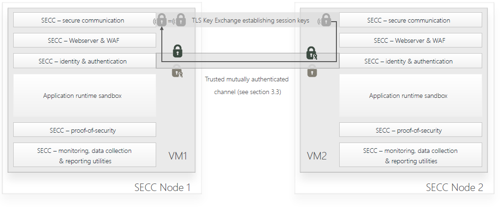]
[(TLS with side channel session key authentication without any need for Certificate Authority)]

The easiest way to perform such a secure comparison of the TLS session key is to export a hash of the TLS session keys and rely on the trusted mutually authenticated identity channel to transfer the TLS session keys to the intended counterparty to verify that no MITM is in the communication channel. 

An alternative way to establish a trusted end-to-end secure communication channel or recover a compromised TLS channel is to use the secure identity channel to create the session keys and then import these session keys into the TLS channel. This is a similar approach to how China’s QUESS satellites are building quantum encrypted end-to-end channels with their quantum key-distribution approach. Our initial research indicates that the use of RootOwl distributed identity where public keys are exchanged only at initialization of a point-to-point relation, can also be used to create an end-to-end communication channel which is resistant to Shor’s algorithm for quantum computers, which would otherwise compromise the security of a typical Diffie-Hellman key exchange and public cryptography in general. 

This import of session keys into TLS from an authentication chanel can also be used to establish an end-to-end secure communication between multiple parties in an accountable way.
3.6.3. TLS without side channel session authentication
In situation where an end-user of developer’s application needs to use a desktop or mobile web browsers, the RootOwl end-to-end security components will not be able to perform the side-channel authentication (via channel binding or key import into TLS). This calls for a fall back to the standard TLS with all it’s negative implications and reliance on the user to verify channel security. A future research should look into ways how one can create a secure end-to-end tunnel inside of the browser’s TLS session and export or import the session key material using an authenticated side-channel.

## 3.7 Secure web server & web application firewall 
The longer term goal is for RootOwl foundation or community developers to include a secure web-server with built-in web application stripping XSS, SQLI and other known malicious requests from the traffic leading to the web applications. Additional features desirable by the webserver is the management and securing of SSL certificates and creating a simple to use interface for application developers to keyless CDN service providers in situation where native RootOwl end-to-end communication isn’t supported by the client browser.

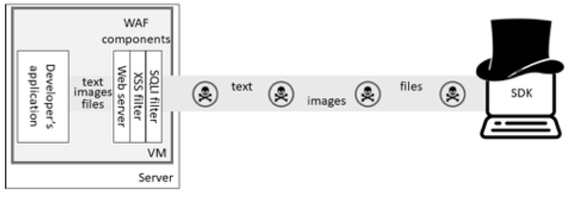
[(Web application firewall components filtering harmful in-channel content)]

Attempted attacks identified by the web application firewall (WAF) will mark the incoming user identity and/or IP address in case of unauthenticated traffic and the data will be shared to Argus and Whois upon the next proof-of-security.

## 3.8 Attacks which can be vastly prevented

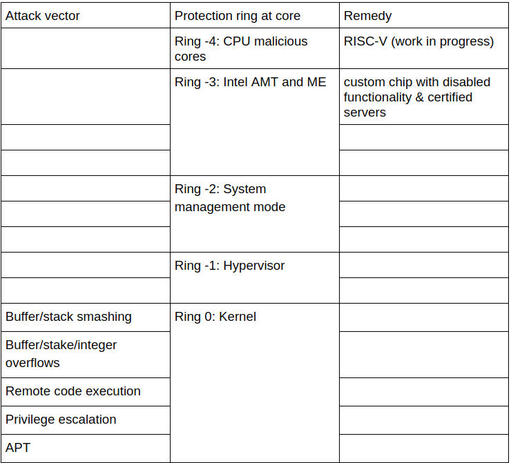
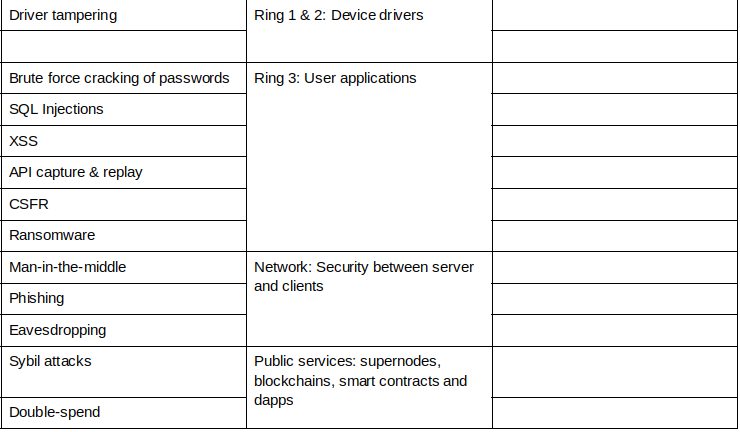

##4 Client-side security Wallet & client SDKs
A security of any system can’t be complete if only the server infrastructure is secure. The RootOwl infrastructure is no difference. The VM provide a wide range of security components, but they often require a client counterpart functionality in order to achieve a 360-degree secure solution. These include:
    • Cryptography libraries
    • Identity & authentication 
    • Signing service
    • End-to-end communication security 
    • Data collection, data reporting, traceability, incident reporting

The security components from the VM can interface with either the the standalone RootOwl wallet or the SDKs embedded into developer’s application, depending on user’s and developer’s preference. He main advantage of the use of the Client SDKs or the Wallet is that the user will be removed from most security related activities because the VM security components and the client SDKs will perform most of the security checks and balances automatically without user interaction. Every security solution which doesn’t require a user to do something right, is a more reliable and secure solution.

## 5 Supernode infrastructure services and community projects
The permissioned supernodes provide the public infrastructure services required to grow and continuously secure the network of nodes and transactions between them. The supernodes can be thought of as a distributed network of notaries. The service will include bookkeeping through a consensus for each individual chain and subchain; maintaining the availability of all the public ledgers; guaranteeing the security, availability and distribution of security updates; propagating security incidents across the network; judging the accountability for security incidents; and operating a whois-like service to provide security-related data transparency over each node and user. The supernodes will be different from nodes mainly in the fact that they will be custom hardened on hardware level as well as with the stricted configuration of the VM, they will all be approved and maintained by the community. Some of the infrastructure services (such as consensus building) will require a micro-fee, which will always be paid in the form of RootOwl tokens. 

## 5.1 Securing root of trust to the supernodes
RootOwl is a distributed secure infrastructure, which systematically eliminates available single-point-of-failure weaknesses. The supernodes play an important role in establishing consensus and providing important services such as SecureDNS. However, as with every distributed permissionless system, the first connection of a node or a user to the system will represent one of the greatest security weaknesses, because two unknown parties need to create the root of trust. RootOwl will provide a multi-layer security to ensure that the root of trust is not broken and to quickly identify such breach.

The supernodes and registration service for users to join RootOwl network will rely on the currently available internet CAs for identification. On top of that both the RootOwl wallet and the publicly available VM will contain a list of trusted nodes in their configuration files. The Argus reporting chain will keep the master consensus of the correct information for both the VM and the Wallet (and SDKs) configuration available so that there is a lower attack change to perform phishing, a DNS attack or other MITM attacks. The supernode should also overtime include a RootOwl native Secure DNS service which should help with a better initial trust between VMs, applications and the supernodes as well as the rest of the network.

The final solution to detect any breaches of the root of trust are the three-party transactions, which can reliably eliminate a MITM attacker at registration, identity verification or other operations.

## 5.2 Performing consensus
Permissioned supernodes will be the only participants trusted with consensus building, block mining and the authority to perform transaction smart contract signing & verification. The consensus and mining the blocks to the blockchain can made very efficient with little or not duplication thanks to the permissioned nature of the supernodes and the fact that supernodes perform a security cross-checks in three-party operations (including authentication with MITM detection & exclusion as well as notary smart contract signing) with every single node which is requesting a transaction to be included in the blockchain. 
A block will be prepared in regular intervals of 5 seconds with all transactions concluded by the deadline. Each supernode signs a the list of agreed transactions in a time-arranged order and a simple consensus is reached using the PBFT algorithm. Based on the reached consensus, one miner is randomly selected to calculate the block with a hashcash around 5 seconds. Once the generation is completed, each supernode receives the new block, verifies the nonce with the generated hash and verifies all the supernodes signatures on the transaction content.

If the randomly selected supernode tries to maliciously change the content of the transactions in the block and creates a nonce & hash to fit a different transaction data, the other supernodes will identify the faulty integrity, because all or some of the supernode signatures will be invalidated in the maliciously generated block. Such a block will be discarded, a new supernode will be randomly selected to perform the blockmining and a new consensus will be built on blocking or reporting the malicious supernode.

Once a block is successfully mined and passes verification by supernodes. Nodes whose transactions were included in the block are informed about the published block.

## 5.3 Administration and development of chains
RootOwl distributed ledger infrastructure will be based on a hybrid public-private architecture. The public ledgers will be universally accessible to every participant or node and it will provide public services such as marketplace, credit-scoring, insurance, bug bounties or resource monitoring. 
Each customer will be provided with a fully isolated chain infrastructure, distinct set of supernodes and distinct ledgers. Each such a private network is required because of 3 factors:
    1. Information confidentiality: the character of the security information stored & managed in the ledgers is highly sensitive and the storage of such data (even if encrypted) on the public ledgers would pose an unnecessary security risk
    2. Storage space: the sheer amount of data generated (such as log storage or file system integrity data) pose high requirements on storage. Consolidating all such data from hundreds or thousands of private networks onto the public supernodes would create an unsustainable storage requirements and costs
    3. Speed: The TPS is typically a key burden to many distributed ledger technologies and despite the fact that PBFT has a high throughput, the distribution of some of the transactions to private networks will serve as effectively sharding the transactions and greatly improve the overall ecosystem TPS performance
The public network is the binding force of the ecosystem and it provides security transparency, permissioned interconnectivity between two or more private chains together (such as for security operation services) and to ensure that all the private networks run up-to-date and compatible versions of the underlying software infrastructure.

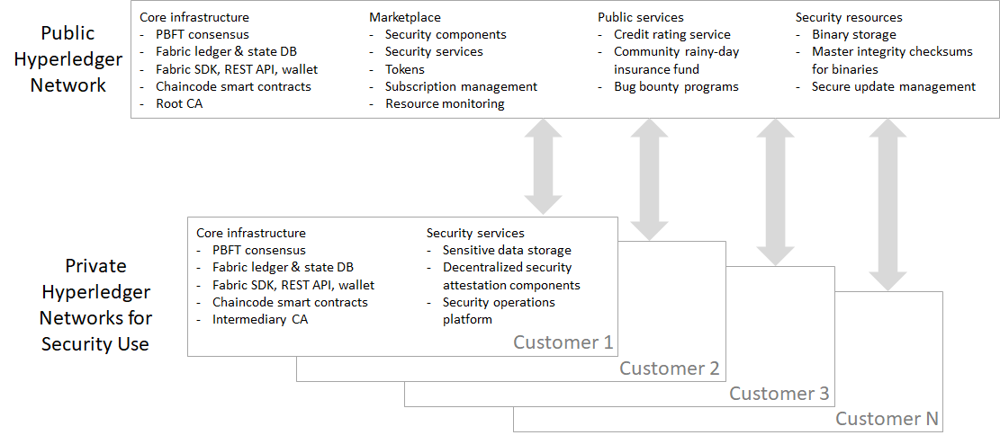

## 5.4 SLA management (mostly availability centered):
    • Use performance validators - a network of regionally dispersed nodes specialized in measuring the performance of nodes which are available for resource sharing (distributed infrastructure or more traditional cloud providers)
    • Performance validators will measure in regular intervals the computation power, bandwidth speed, availability and available RAM capacity using the proofs described below
    • Tools to execute remote performance management should be basically a Dapp running in isolation in the Dapp sandbox. There should be a parametric limitation of number of simultaneous performance checks (probably with the exception of latency & availability tests)
    • Argus chain should be considered the police

## 5.5 Secure distribution of updates
Developing and distributing updates for the infrastructure will be a key concern, because attacks on this process can create systematic weaknesses in the whole network. Moreover, automated remote updates for all security components will greatly lower the burden on developer’s system administrators, who constantly struggle to keep their application up to date and protected, which is made worse by mixing security source code into applications themselves and thus occasionally requiring a new application release just to update a security feature. The solution isn’t only technical but also governance related. 

Each VM will perform an update check whenever it performs a proof of security with Argus supernode network and once the update is detected, the VM will proceed to download the update from the supernode network. The VM will perform its own update data integrity verification and compare own result with the consensus available in the Argus chain. If the update package footprints check out, the VM proceeds with the update. 

After the update is completed, the VM performs a proof-of-security to verify its own integrity and builds a Merkle-tree. The VM code base footprint, configuration footprints, logs and Merkle-tree are sent with Argus supernodes in order to verify the successful completion of the update according to the integrity defined in the consensus.

## 5.6 Incident reporting and blacklisting shared across the whole community
Incident reporting will include Issuing a network wide alert of compromised authentication keys, reporting on DDoS and other kinds of attributable attacks and which nodes and operators initiated them. Reports also include informationon compromised integrity of update source code in order to identify and shut down any xcode-ghost style of attacks. Once a misdoing is confirmed, the Whois service will record the information and all parties in the network might choose to their apropriate action towards the malicious users, nodes or even supernodes. These actions might include higher transaction fees, blacklisting or even removing user and her tokens from the RootOwl ecosystem. If the affected party insists innocence, it can pay an accredited independent auditor to identify a problem and provide a conclusive results to remove the affected party from the blacklist.

## 5.7 Supernode rewards and fees
Supernodes transaction verifications don’t necessarily or always require all supernodes to be involved. To rewards nodes based on the actual service performed, the transaction fee will split and distributed to all those supernodes which performed the transaction verification based on the number of verifications performed. 

## 5.8 Backup and restoration services
    • Backups and restorations are a key security function and initially it will be built via a simple system cloning function to move installed dapp, data and configurations between nodes.
    • In the spirit of RootOwl SOA architecture, the backup and restoration will build on top of the of the secure authentication & authorization, secure communication components to move data securely to and from the backup nodes
    • Proof-of-availability, proof-of-connectivity, proof-of-storage and potentially the key management service will be also used when opting for backup & restoration on a distributed network of 3rd party nodes instead of using own hardware.
    • We estimate that there will be an emergence of open-source, freemium services which will bundle and automate the initial deployment and operation of the backup & restoration service in order to further ease the overall security of application running on RootOwl

## 5.9 Recoverability from a hack or compromise
Every security system must be built in such a way that any major compromise doesn’t create a permanent security vulnerability. A great example is the use of physical devices to store identities and authentication keys. It might appear like a safe way, but it actually turns out to be terrible security practice. Payment cards are a prime example. The use of magnetic stripes for payments has been introduced in 1970s and many institutions invested in the technical infrastructure to support payments with these cards. The system was quickly discovered to be prone to card cloning, replay attacks and other major security vulnerabilities. The only reasonable solution was to remove the cards from circulation and replace it with EVM when then appeared in 1986, however the accumulated costs in the infrastructure and large costs associated with a transition to EVM lead to the use of this inherently insecure and obsolete technology for 3 more decades in some countries. EVM standard is definitely a step in a better direction, but if there is a critical bug discovered in the chip implementation, the speed and cost of getting new cards to people’s hands is also generally prohibitively high. 

Blockchain technology has made breakthroughs in achieving data integrity and consensus in inherently trustless environments. However, the technology still struggles in its ability to recover from large hacks. If token are stolen by an attacker, there typically is no way to recover the funds. If blockchain are used for storage of criminal records or if tokens represent physical ownership of land, a compromise of the token and maliciously achieving false data in the blockchain might completely void the usefulness of the chain. 

## 5.9.1 Recoverability of stolen tokens via accountability and a grand consensus
The RootOwl infrastructure and primarily the identity is fully accountable and every breach can be either prevented through hardware footprinting or at least detected and proven through multiple layers of mutual cross-checks and balances. The fundamental used algorithms, identities and cross-checks can be reset and re-secured via over-the-air updates, identity verifications or three-party operations, however the inherit accountability leads to a unique ability of the infrastructure and all participants to objectively create a consensus on an compromise. Such a consensus can open opportunities to create a grand jury of nodes or users who will decide on restoring the affected assets and punish the culprits. This process would require an explicit community support, financing and governance, but it might represent a functional way for blockchain public ledgers to recover from a breach. 

## 5.10 Whois-like or credit-rating server for a review of used APIs and security configurations
Data and security transparency needs to be at the heart of each distributed models, because a permissionless distributed model can create some dark corners. The use of RootOwl by itself doesn’t automatically guarantee that every single node or application will be made secure and there is no guarantee that malicious developers or hardware owner will not want to leverage an image of security to evil purposes. We believe that the community should provide a public service, which will source data from Argus chain and provide a security scoring of each VM, application as well as user.

The Whois-like information on the VM would include information about the hardware security through Harbian audit as well as basic system parameters of the underlying hardware (CPU specifications, available bandwidth, storage, RAM and GPU) as well as report on incidents verified by the machine or the owner. This information should serve as a basis for a developer to choose and buy a VM on the right hardware for her needs.

The information on the application should create a security and privacy score for users to easily review and decide if a given application meets their requirements. The security and privacy score will be based on the information on utilized APIs, update status of VM and the security components, identified delinquency (such as not paying for premium open source libraries or not paying to consultants).

The information on users will include mainly a known list of delinquencies such as unknowing participation in DDoS attacks, XSS or other attacks; acting intentionally as a black hat hacker, running an insecure application on an insecure VM or cheating on using premium services without paying for them. The collected information might also be used to dynamically adjust transaction fees or even blacklist a user from the system. The actual implementation of the fee adjustment and blacklisting functionality will first need to be approved and continually fine-tuned by the community.

## 6 Community support and services
In a world where there are 1000 security solutions for each security component, such as XSS libraries, there is a serious brain dilution of community and research experts who are able and available to review the security aspects of a given security function. In such a situation with large dilution, the open-source security could actually cause more security risks than benefits, because there are asymmetric rewards for a black hat hacker as opposed to the white hat hackers. RootOwl is committed to an open ecosystem and its ability to offer alternatives for security components by building a functional incentive system to create sufficient concentration of community experts for each available security component. We believe RootOwl absolutely can turn around the asymmetric security benefits towards the the white-hat hackers and the community of expert contributors as well as progressive startup innovators.

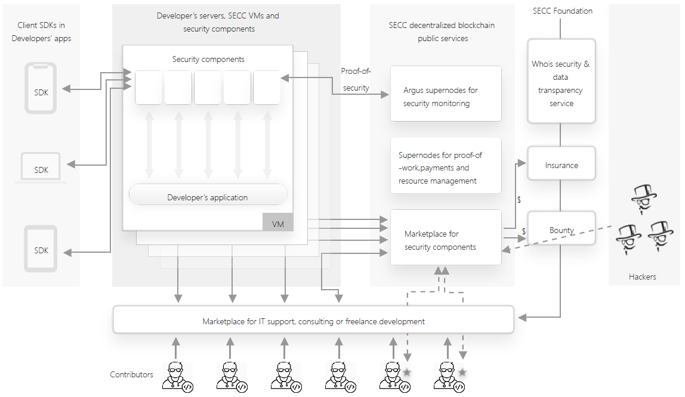

## 6.1 Blockchain-backed community marketplaces
Decentralized systems require services for discovery - the Internet has Google, Reddit and a myriad of marketplaces such as ebay or amazon. RootOwl foundation will help form 2 distinct marketplaces - for resources and for services. The marketplaces will run on a supernode level, be backed by blockchain, whois data transparency service and the security-centered release process (see below). 
6.1.1 Resource marketplace for security components and solutions
The RootOwl infrastructure will mainly focus on security components and tools for developers to build their applications faster and more secure. However, the RootOwl infrastructure should create a fertile ground for contributors, startups or even established companies and to introduce their own components and whole solutions build on top of RootOwl infrastructure and security components. These might include anything from an AWS-like VPS, website hosting, secure email servers, VM/container orchestration solutions and many more. As the number of resources and components offered grows, there will be increasing need for a transparent marketplace where developers can discover security components and other solutions to help them build their applications even faster and even more secure.

### 6.1.2 Community marketplace for IT support, consulting and other services
A secondary, potentially more important marketplace will be for services, because as developer’s applications gain popularity and scale up or as ever more critical systems are build on top of RootOwl infrastructure, the developers will require stricter SLAs and more specialized help growing their applications and related infrastructure. RootOwl foundation will provide basic limited support via the marketplace, but the goals is to establish a Red Hat- and freelancer-like decentralized service model backed by blockchain and transparent data. 

The developers and corporate customers will require a professional support in order to consider development of applications for RootOwl infrastructure. This represents a great opportunity to create a community version of the Red Hat model. RootOwl community will be able attract contributors and reward them with reputation points and certifications for their code-, wiki- and Q&A-contributions within RootOwl ecosystem. Contributors can choose to be publicly listed as consultant for hire. This will both create a financially sustainable way for open-source contributors to earn income through community freelancing and it will create a greater adoption among enterprise customers.

Any developer, corporate partner or a member of the community can create community projects and dedicate dollars or token incentives to attract community experts and contributors to join. 
    1. Parties can publish project and development requirement on chain and look for the target contributors according to their rating and skillset
    2. Developers can search and find jobs according to the published list to join in the project to develop applications or tool and get paid
    3. The actual contracts can be created with KPIs and milestones in the form of smart contracts for transparency and to avoid most disputes.

## 6.2 Native and systematic bounty program to drive community white-hacker engagement
If a security component and service include a premium pricing, 1% of the proceeds should be allocated into a bounty programs. If there is a critical vulnerability, 30% of available bounty treasure should be paid out. If major vulnerability is identified, 3% bounty is paid out. Other vulnerabilities take 0.3% of the available bounty. Keeping the bounty denominated in tokens limits supply of tokens in the economy and thus creates positive pressure on token appreciation.

## 6.3 Developer insurance program
The insurance program in RootOwl community aims at helping affected parties. Whenever purchasing any premium security component or features (potentially also other token/money transaction), a small ~1% fee will be placed into the insurance rainy day fund. This insurance fund has two powerful benefits. It creates lower risk for developers to join in the community because they will get potentially significant payoffs in case of a proven exploit through RootOwl security components and infrastructure and the fund keeps the insurance funds denominated in tokens and thus helps decrease the token supply in the economy and drive token value appreciation.

## 6.4 Security-centered release process
One of the greatest benefits of the open-source solutions is enabling anyone to review and improve the solutions, so the release process is building on this heavily. Second of all, RootOwl ecosystem has an incredible ability to connect previously disconnected software development activities - problem identification, implementation, deployment. There are bug reporting platforms such as hackerone or Mitre’s CVE, however these are largely detached from actual development and communities. GitHub is the largest code repository of code in the world with countless open-source projects, yet few are well organized and connected to hacker and bug hunter communities. Moreover, having code at GitHub no way means that updates are pushed to all clients and servers. RootOwl release process integrates bug bounties, hacking incident reporting together with the community developing the security components and an automated release process (similar to Google Play release & auto-updates) delivers security updates to all VMs without affecting the operation of the Developers’ applications running inside of the VM.

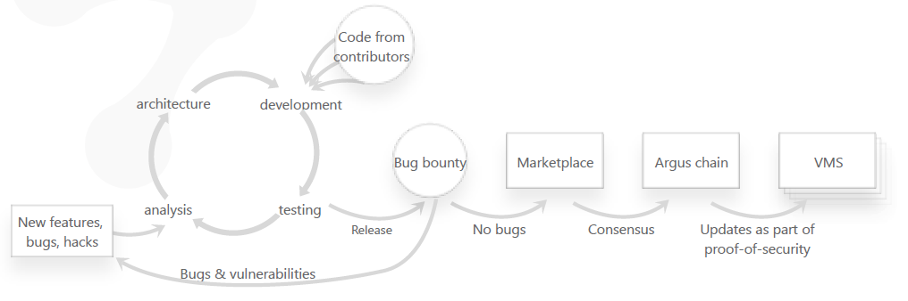

Each system feature and component will have its own maintainer, who will be responsible for a review of all code submitted by contributors. Staging will include an iterative deployment in an independent isolated RootOwl subnetwork where automated testing public review will be performed. On top of there, a special one time bounty budget will be created to maximize the amount and quality of the review. Security software development isn’t application development - Security can’t follow the mantra “done is better than perfect”, the marketplace release process can move forward only after all bugs have been fixed and tested and after enough time has been given to the reviewers and white hat hackers. 

Once an update is considered ready and is released to the marketplace, Argus supernodes will create a consensus on both the proper Proof-of-security footprint for various VM variations and the data integrity of the actual update package. The consensus and the update package will be published in the Argus chain and the VMs will perform a secure update during their next proof-of-security verification.

##7 Business adoption rationale

## 7.1 Predictability of capital budgeting and business environment to support long term investments and customer adoption
All the services used and value exchanged on RootOwl will be intermediated through RootOwl token. However, a required preconditions for an easy and fast adoption of the RootOwl distributed infrastructure is to have a transparent capital budgeting and business environment. Hobbyists, entrepreneurs and enterprises need to be able to plan their investments into infrastructure and app development and know what their prices for services won’t inflate 2x or even 100x over a mid-term period as it was the case with bitcoin, ethereum and other token currencies. The token will be free-float and is expected to appreciate significantly (see section on growth) however, the service prices and service payouts will be pegged to the US Dollar or other fiat currencies initially. This will provide a cushion to protect the RootOwl token against speculation, currency manipulation over the short term and establish the RootOwl token as a stable, growing, business accepted token for the long term.

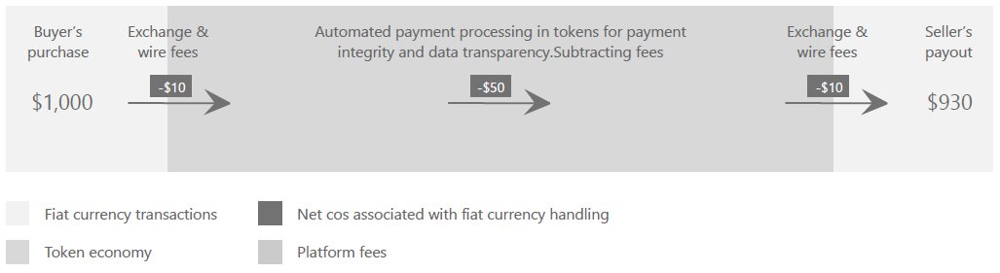
[(Budgeting transparency by pegging costs and payouts for services to
fiat currency. Scenario assuming no profit reinvestments or token
buy-back program)]

## 7.2 Savings on new or existing security solutions
The application and software development on RootOwl directly saves costs on sourcing and largely maintaining security services because many are to be provided natively through the RootOwl security components. These savings should be substantial enough to justify budgets and projects to build new services or even migrate existing services onto RootOwl infrastructure even in situations when a company has legacy systems or faces minimum variable costs of expanding security through sunk costs.

##7.3 Ease of development
Development of apps features, databases and user interface on RootOwl bears no additional costs compared to the development done today.  

However, there is a great benefit of and an adoption driver to build applications on the RootOwl infrastructure - the actual development of applications and software services is going to be significantly faster and cheaper (aside from more secure) for the companies as they don’t need to spend time and resourcing learning how to build own security solution or try to hardwire and debug some open-source libraries into their code base. A good reference model is development of apps for Android, where developers don’t need reinvent solutions for camera control and capture (equivalent of security components in RootOwl) for various phones and tablets (equivalent of diverse computing platforms and hardware) because Android (equivalent of RootOwl platform) provides APIs to handle such and many other core features natively.

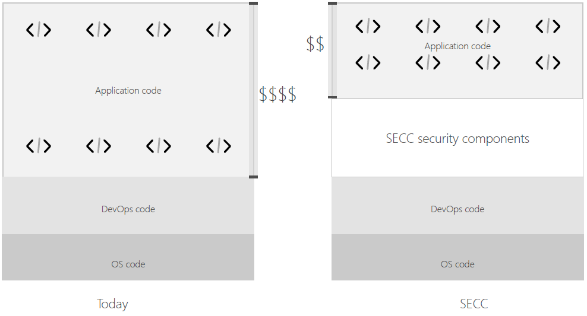]
[(Developer’s savings by relying on 3rd party security components
instead of building them)]

In summary, the economic benefits of developing and migrating and application to RootOwl are so significant that they should justify investments and decisions to use RootOwl even in companies which are short on IT & IT security budgets (such as SME) and even in large established companies where the savings on a myriad of security components easily add up to millions or tens of millions of USD annually.

## 7.4 Easy deployment with pre-hardened, flexible configuration 
The RootOwl will provide a customized VM installer based on needs of the customer for security components; selected computing infrastructure; the purchased premium features; and node importance. Once the VM is installer is delivered to the customer the actually deployment should take minutes. Future development by the community and/or RootOwl will include wizards for network configuration, creation of service clusters and an integration into existing service clusters. 

The final version of the RootOwl will also include devops tool for systematic management of service scalability and high-availability. The initial intention is to port docker into the VM and connect it to natively use the available security components (e.g. authentication within cluster, policy configuration for groups, consolidated reporting, encryption of data at rest and incident management among others), and potentially the ecosystem-wide security cooperation services (such as distributed end-to-end secure communication, secure updates,  see below). 

The ultimate goal is to provide a comparable ease of deployment as with current container solutions but in a RootOwl secure way. 

WIP: High-availability, scaling, sharding and pooling might be also achieved through the virtual machine base functions merged together with the security components described above (mainly authentication, secure communication and proofs)

## 7.5 Reinforced freemium model for security components in an open-source world
The premium level service is important to achieve a sustainable continuation of development of security blocks; funding of bounty-programs and operation of public core infrastructure such as super nodes and community fora. However, payments for premium services are typically harder to enforce when all code is open-source and freely available for anyone to use. 

This challenge is addressed architecturally in the RootOwl to create cost incentives to pay for premium rather than fork and manually deploy. All VMs will be regularly checking with the public chains and supernodes for available patches and updates and these communications will include an authenticated, proven list of used APIs, SDKs, libraries and used services so that the right patches are sent back. If however a node is identified to use a premium APIs or feature without recorded payments on the public ledgers (where all purchases, including premium features are tracked), an update of all services and access to certified consultants will be denied. The node-operator will still be able to use the premium APIs or features and compile his/her own update for all the available components but the logic is that this will represent much larger cost and risk over the long term than paying a premium service. If the owner of a node continues operating without the updates, the whois-like service will soon mark the nodes and dapp service as insecure. Users will subsequently be notified to be cautious using the service and that might affect long term service usage. 

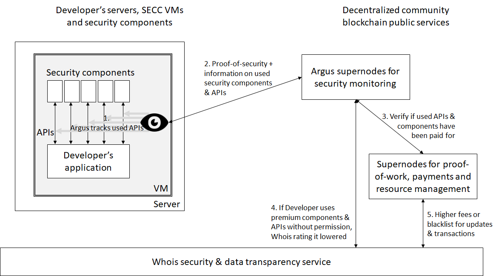
[(Reinforced freemium model workflow)]

All developers and companies who offer premium open-source security components or features in RootOwl economy will be protected by GNU GPLv3 open source licence which sets favorable permissions to review all the code but limit the changes or use of the code without permission. This licensing scheme will help ensure that developers are not risking to lose their business opportunities by going open-source.

## 8 Governance
The open-source and hacker mindset is at the core of the community and the RootOwl must stay true to it if it wants to attract the best people to contribute. Complete anarchy, no matter how attractive, isn't however a sustainable solution because RootOwl will sooner or later face a for-profit copycat where large companies will want to replicate RootOwl architecture for a hefty profit. The OS wars of Microsoft against Linux are a cautious example where a greater product can fail to reach and help people because it is fundamentally under funded and lacking a holistic vision. Any governance will this be a balancing act. We describe here a vision for an inclusive governance, but we will also actively work with the community to change it and improve it as we will with the overall technological architecture and security components.

## 8.1 Voting
Bitcoin despite its openness and permissionless approach shows the failure of free market. A handful of Chinese miner with the greatest economies of scale now dominate over 50% of hashing power and control a disproportionate voting power because of the grassroot fragmentation. To counter that, we propose a voting system based on a rule of decreasing returns, where you get a smaller unitary voting power with every RootOwl token in your possession. The decrease will be small but it will help balance interests of the grassroot community and individual contributors, progressive security startups with the largest miners and entities with the largest accumulated investments into the infrastructure. 

## 8.2 Frontier security research institute
RootOwl community will organize and publish non-profit security solutions and blockchain security solutions, such as kernel hardening solution, ARM platform firmware vulnerability analysis solution, trusted framework security hardening solution, hardware wallet deep reinforcement solution, security system construction of digital currency wallet, etc. In order to promote the development of cutting-edge security research, RootOwl will also set up investment for security research institutes.

## 8.3 World security round table meeting
RootOwl host one World Security Roundtable Meeting per year to invite community members for open discussion and technology communication, to accelerate the development of cyber security.

## 8.4 Investment Program
RootOwl foundation will invest a few percent of the coins as investment and incubation program, which will offer Tokens to the potential promising projects as community investment.

## 8.5 University partnerships
RootOwl will provide a free access and token to universities in order to help students learn blockchain, security or develop their application ideas for RootOwl. The program will serve to develop awareness and teach the future developers and IT managers how they can build applications and solutions for RootOwl network.

## 9 Token economy & ICO
The tokens economy must be built to be sustainable and to generate a positive operating value. If a company can’t generate a positive operating cash flow and a positive cover margin to amortize fixed costs, it will run out of money and fail. Pouring ever more and more investments into a company which doesn’t generate a positive operating cash flow and a positive cover margin is a definition of a Ponzi scheme. This is all obvious, but it is not often the case. Filecoin is a perfect case in point. Filecoin economy doesn’t have any positive operating mechanisms to generate a contribution margin, which can be used to amortize earlier investments by investors and it is a prime example of a token economy, which is built to destroy investor value. 

## 9.1 The perils of an inflation economy
The original Filecoin ICO has raised $257m at a total coin valuation of $3bn. The $3bn represent a surplus value of coins that can’t be immediately used buy the actual storage capacity, because he raised sum of $257m is not used to purchase storage and because the servers and drives need to be first purchased in fiat currency. Shall a large portion of issued Filecoins be converted to fiat to purchase the storage, the price of the coins would crash, erase the investors’ value and yet not meet consumer demand. The problem with excess coins is massive. The Filecoin economy starts with $3bn worth of Filecoin and no storage available (that’s today’s situation). Let’s also assume that 1-TB-for-1-month of storage costs $5 worth of Filecoins. Filecoin economy will require 600 million TB-months (or 5 Exabytes used storage for 10 years) just to satisfy the coins in circulation. For your reference, Facebook had 100 PB of storage at IPO. However, Filecoin economy rewards miners (storage hosts) with new coins in relation to the storage capacity they introduce to the system. If consumers use $10 to buy $10-worth of Filecoins and if hosts convert all $10-worth of Filecoins back into USD, the demand is equal to the supply and the price of Filecoins in relation to dollar doesn’t change thus we can say that the Filecoin economy reached an operational supply-demand equilibrium. However, due to the mining rewards, whenever a consumer uses $10 to buy $10-worth of storage, the miners will end up with more than $10-worth of coins. Once they try to cash out, the price will inevitable go down, because the demand for Filecoins ($10 from buyers) is lower than the supply of Filecoins (more than $10 from sellers). Filecoin also fails to provide any operational mechanisms to remove excess coins from circulation.

## 9.2 RootOwl economy’s ability to generate amortization & contribution margin 
Whenever a token economy raises money using the ICO, there must be a financially sound operational business mechanism, which will amortize the surplus coins from ICO. The most fundamental driving force to achieve this is by building mechanisms which prevent or incentivize a situation when the value token purchased is equal or less than the value from leaving the token economy. The trends of token value can be explained through the contribution margin.

Amortization contribution margin = value of tokens converted from other coins or fiat (increasing demand) + value of tokens removed from liquid supply (lowering supply) - value of new coins created (increasing supply) - value of coins converted to other tokens or fiat (increasing supply)

If the contribution margin is positive, the token value will be positive.

The contribution margin can be broken down in a similar way as cash flow statement: operating, investing and financing. 

Contribution margin through financing will create a positive pressure on token value if the value of loans provided by RootOwl participants is larger than token value of loans taken by RootOwl participants. However, we can assume that the financing amortization will be zero until the RootOwl tokens and economy achieves a dominant position. Moreover, RootOwl foundation has no plans to become a bank and develop this kind of model.

Contribution margin through financial investing would create a positive pressure on token value if the value of incoming financial investments is larger than the value of outgoing financial investments. This is largely out of control in the short term because any speculator could flood or drain the token economy and thus skew the larger trends. The mid- to long-term view on investing however shows that financial investments will be driven by the economy’s ability to create positive value through normal operation and this is where the operating contribution margin makes all the difference.

If operating contribution margin would create a positive pressure on token value if the value in fiat currency or other coins used by buyers to purchase goods & services in the RootOwl economy is larger than the value of outflows by sellers who convert their sales for goods & services in the RootOwl economy into fiat currency or other coins. If the value inflows is larger than the value outflows, the economy achieves a positive contribution margin, which amortizes the value of coins raised in ICO and creates a positive growth of token value compared to fiat and other coins (as long as the operating contribution margin is larger than that of the compared economies). 

RootOwl economy has several operating mechanism which create a positive contribution margin:
    • Insurance program should over time capture a large amount of coins in rainy day funds and thus removing the coins from operating circulation
    • Bounty program fee will over time remove the coins from circulation in the same way as the insurance program
    • Transaction fees and mainly the profits on them will remove coins from seller who want to fully cashout
    • Voting based on number of coins creates a strong incentives to all sellers to accumulate the coins so that development of the infrastructure goes in the way good for their sustained business
    • Retained profits on the RootOwl foundation supplied premium services will also remove coins from circulation. This is especially powerful because the decentralized nature of security components means that RootOwl foundation can develop premium security components at fixed cost and all variable costs for the security components are paid by the VM operator. The effect of retained profit by RootOwl foundation will grow hugely with scale in adoption and this effect can be viewed as a major incentive to invest into the RootOwl ICO
    • Growth of the economy also plays a powerful role, because the economy will realize economies of scale and thus increase profit retention and directly drive positive contribution margin through investing cash flows

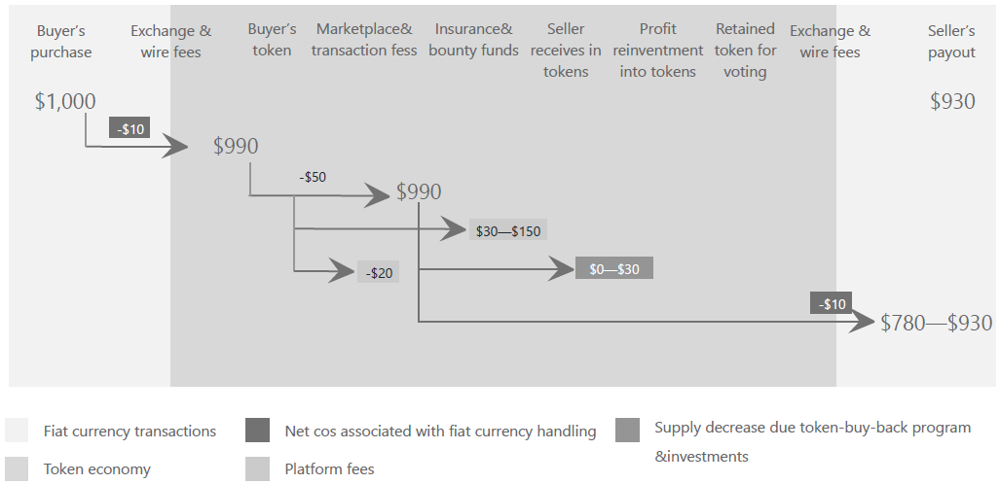
[(Possible breakdown of retained value within token economy)]

-------------------------------------------------------
PLEASE READ THE ODT FILE................
...............................................
....................................................
-------------------------------------------------------

## 12 Abbreviations and definitions
DLT = distributed ledger technology. It’s a generic term for public ledgers such as blockchain or tangle.
Node = is a generic name for a participant in the RootOwl infrastructure. Each node runs 1 RootOwl VM
VM = VM is a RootOwl Virtual Machine, which is required in order to turn an internet-connected server into a RootOwl node
ME = Intel Management Engine. An autonomous component in Intel chipsets designed for a remote administration of the hardware
WAF = web application firewall. A in-channel protection typically against OWASP TOP attacks such as SQL injections, Cross site scripting, deserializations etc.

## 13 Index of pictures
## 14 References

https://www.statista.com/statistics/595182/worldwide-security-as-a-service-market-size/
https://www.kroll.com/en-us/intelligence-center/press-releases/businesses-report-all-time-high-levels-of-fraud 
https://www.csis.org/analysis/economic-impact-cybercrime 
https://wiki.ubuntu.com/USNAnalysis
https://github.com/hardenedlinux/hardenedlinux_profiles/blob/master/slide/hardening_the_core.pdf
https://android-developers.googleblog.com/2017/08/hardening-kernel-in-android-oreo.html 